# 小组项目报告  
  
## 小组成员  
  
- **韩政烨**（组长）——讲解  
- **刘明浩**——笔记及说明  
- **屈浩楠**——研究报告  
- **刑乂烺**——网页设计  
- **闫恩培**——程序设计
**[AI风暴组的Vlog](http://xhslink.com/gLw2qP)**  
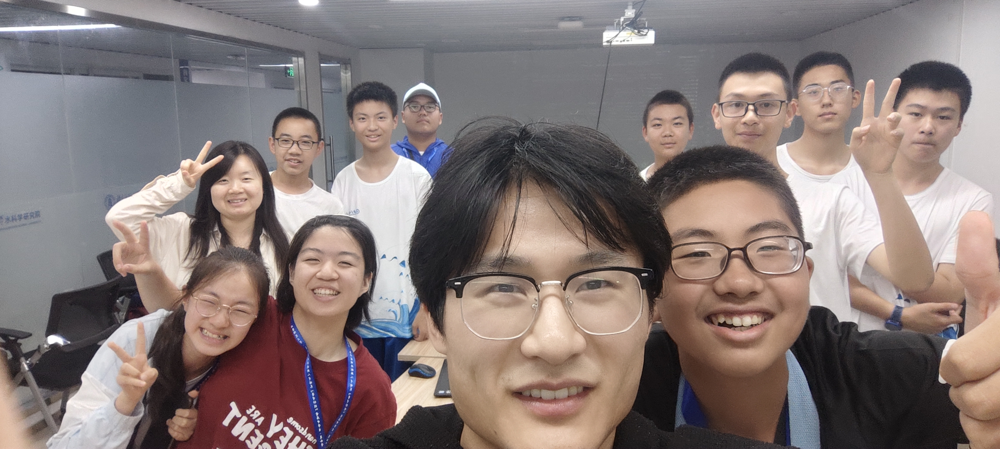  
## 笔记  
  
1. **数据**  
2. **代码数据处理，构建模型，模型保养**  
3. **估量展示**，一般会以一个数据，一个指标、是机器或计算机模仿人类（或人脑）的智能技术解决实际问题  
  
## 关于“水”的认识  
  
### 水的重要性  
  
- **生命之源**  
- **生产之要**  
- **生态之基**  
  
### 水的双重性  
  
- **资源性**  
- **灾害性**  
  
### 水文学的基本认识  
  
- **水循环进程**  
- **核心要素**：降水、蒸发、径流等  
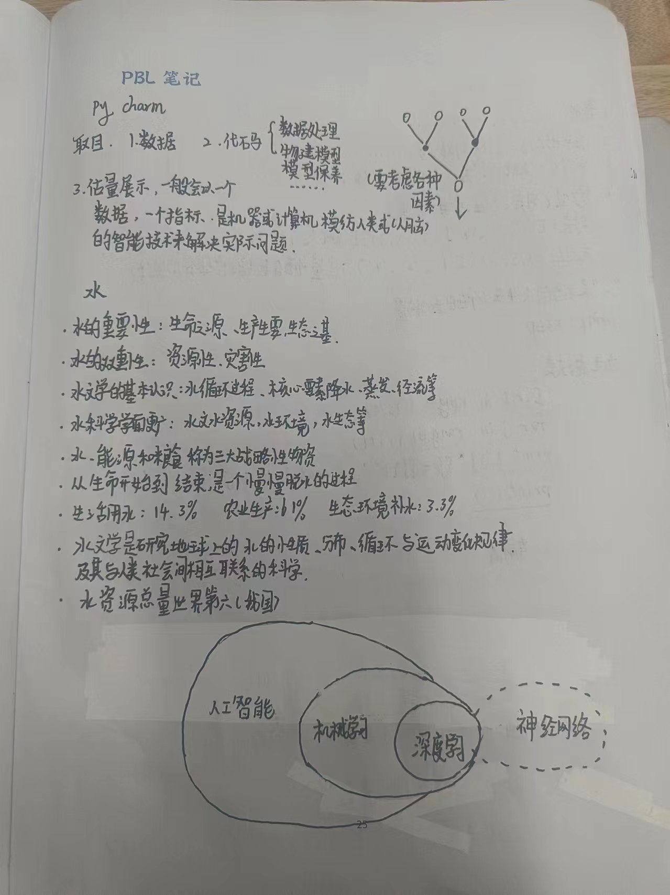  
  

### 水科学的范畴  
  
- 水文水资源  
- 水环境  
- 水生态等  
  
### 水的战略性地位  
  
- 水、能源和粮食称为三大战略性物资  
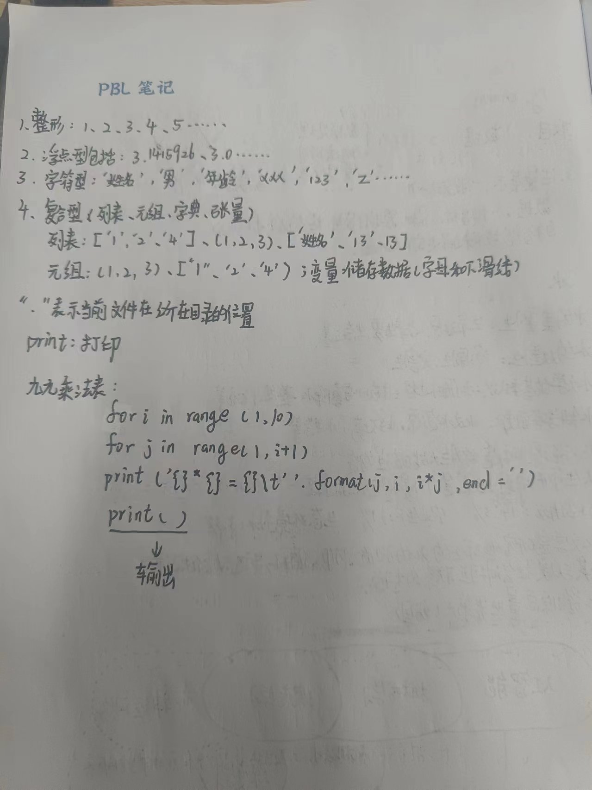  
### 水的分布与使用  
  
- **生活用水**：14.3%  
- **农业生产**：61%  
- **生态环境补水**：3.3%  
  
### 水文学的定义  
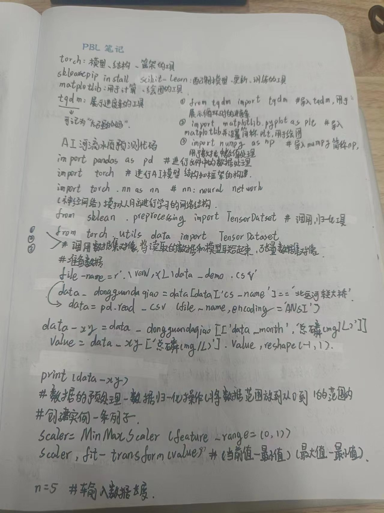  
- 研究地球上水的性质、分布、循环与运动变化规律及其与人类社会间相互联系的科学  
  
### 我国的水资源状况  
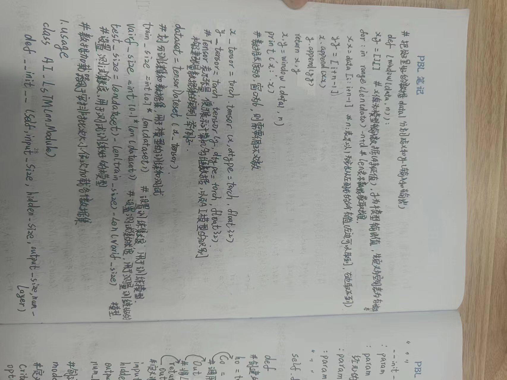  
- 水资源总量世界第六  
  
---  
  
## 数据类型  
  
- **整形**：1、2、3、5……  
- **浮点型**：3.145926、3.0……  
- **字符型**：'姓名'，"男"，"年龄"  
- **复合型**：列表、元组、字典、张量  
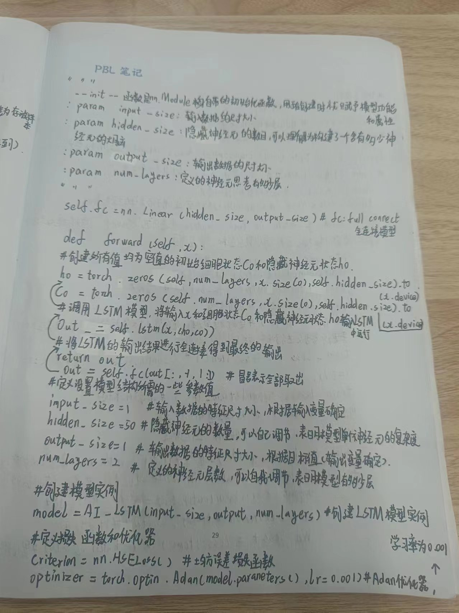  
---  
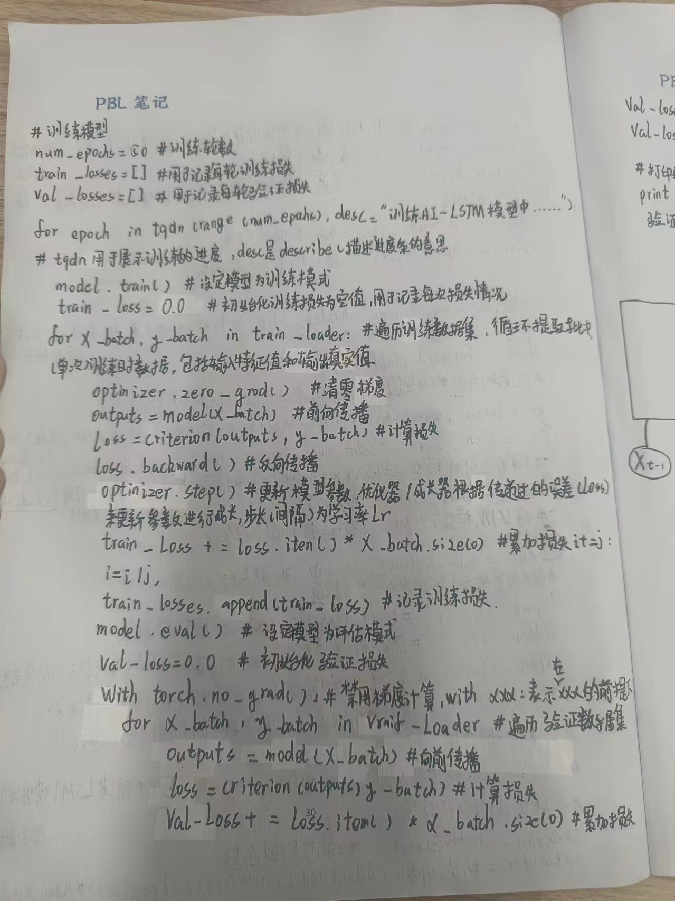 
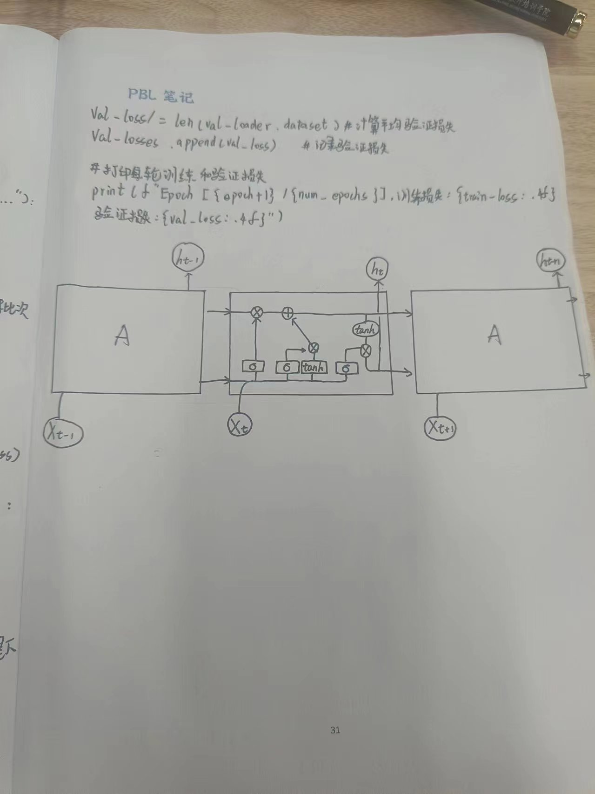   
## 代码展示  
  
```python  
import pandas as pd  
import numpy as np  
import torch  
import torch.nn as nn  
from torch.utils.data import DataLoader, TensorDataset, random_split  
from sklearn.preprocessing import MinMaxScaler  
import matplotlib.pyplot as plt  
from tqdm import tqdm  
  
plt.rc('font', family='Microsoft YaHei')  
# 读取数据  
data = pd.read_csv('./lq01_data/data_demo.csv', encoding='ANSI')  
  
# 数据预处理  
data['date'] = pd.to_datetime(data['date'], format='%Y%m%d')  
data.sort_values('date', inplace=True)  
data = data[data['cs_name']== '北运河东关大桥']  
values = data['总磷(mg/L)'].values.reshape(-1, 1)  
  
# 数据归一化  
scaler = MinMaxScaler(feature_range=(0, 1))  
scaled_values = scaler.fit_transform(values)  
  
# 构建滑动窗口序列  
def create_sequences(data, n):  
    xs, ys = [], []  
    for i in range(len(data) - n):  
        x = data[i:i+n]  
        y = data[i+n]  
        xs.append(x)  
        ys.append(y)  
    return np.array(xs), np.array(ys)  
  
n = 5  # 滑动窗口大小  
X, y = create_sequences(scaled_values, n)  
  
# 转换为Tensor  
X_tensor = torch.tensor(X, dtype=torch.float32)  
y_tensor = torch.tensor(y, dtype=torch.float32)  
  
# 划分数据集  
dataset = TensorDataset(X_tensor, y_tensor)  
train_size = int(0.7 * len(dataset))  
val_size = int(0.2 * len(dataset))  
test_size = len(dataset) - train_size - val_size  
  
train_dataset, val_dataset, test_dataset = random_split(dataset, [train_size, val_size, test_size])  
  
# 数据加载器  
batch_size = 4  
train_loader = DataLoader(train_dataset, batch_size=batch_size, shuffle=True)  
val_loader = DataLoader(val_dataset, batch_size=batch_size)  
test_loader = DataLoader(test_dataset, batch_size=batch_size)  
  
# 定义LSTM模型  
class LSTMModel(nn.Module):  
    def __init__(self, input_size, hidden_size, output_size, num_layers):  
        super(LSTMModel, self).__init__()  
        self.lstm = nn.LSTM(input_size, hidden_size, num_layers, batch_first=True)  
        self.fc = nn.Linear(hidden_size, output_size)  
      
    def forward(self, x):  
        h0 = torch.zeros(num_layers, x.size(0), hidden_size).to(x.device)  
        c0 = torch.zeros(num_layers, x.size(0), hidden_size).to(x.device)  
        out, _ = self.lstm(x, (h0, c0))  
        out = self.fc(out[:, -1, :])  
        return out  
  
input_size = 1  
hidden_size = 50  
output_size = 1  
num_layers = 1  
model = LSTMModel(input_size, hidden_size, output_size, num_layers)  
  
# 定义损失函数和优化器  
criterion = nn.MSELoss()  
optimizer = torch.optim.Adam(model.parameters(), lr=0.001)  
  
# 训练模型  
num_epochs = 1  
train_losses = []  
val_losses = []  
  
for epoch in tqdm(range(num_epochs), desc=f"训练AI-LSTM模型中......"):  
    model.train()  
    train_loss = 0.0  
    for X_batch, y_batch in train_loader:  
        optimizer.zero_grad()  
        outputs = model(X_batch)  
        loss = criterion(outputs, y_batch)  
        loss.backward()  
        optimizer.step()  
        train_loss += loss.item() * X_batch.size(0)  
      
    train_loss /= len(train_loader.dataset)  
    train_losses.append(train_loss)  
  
    model.eval()  
    val_loss = 0.0  
    with torch.no_grad():  
        for X_batch, y_batch in val_loader:  
            outputs = model(X_batch)  
            loss = criterion(outputs, y_batch)  
            val_loss += loss.item() * X_batch.size(0)  
      
    val_loss /= len(val_loader.dataset)  
    val_losses.append(val_loss)  
  
    print(f"Epoch [{epoch+1}/{num_epochs}], 训练损失: {train_loss:.4f}, 验证损失: {val_loss:.4f}")  
  
# 测试集评估  
model.eval()  
test_loss = 0.0  
predictions = []  
actuals = []  
with torch.no_grad():  
    for X_batch, y_batch in test_loader:  
        outputs = model(X_batch)  
        loss = criterion(outputs, y_batch)  
        test_loss += loss.item() * X_batch.size(0)  
        predictions.extend(outputs.cpu().numpy())  
        actuals.extend(y_batch.cpu().numpy())  
  
test_loss /= len(test_loader.dataset)  
print(f"测试损失: {test_loss:.4f}")  
  
# 反归一化  
predictions = scaler.inverse_transform(np.array(predictions).reshape(-1, 1))  
actuals = scaler.inverse_transform(np.array(actuals).reshape(-1, 1))  
  
# 绘制真实值和预测值的折线图  
dates = data['date'][n+train_size+val_size:len(data)]  
plt.figure(figsize=(12, 6))  
plt.plot(dates, actuals, label='真实值', color='blue')  
plt.plot(dates, predictions, label='预测值', color='red')  
plt.xlabel('日期')  
plt.ylabel('总磷(mg/L)')  
plt.title('真实值与预测值对比')  
plt.legend()  
plt.grid(True)  
plt.show()
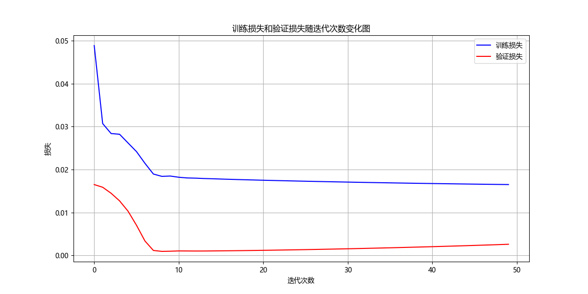 
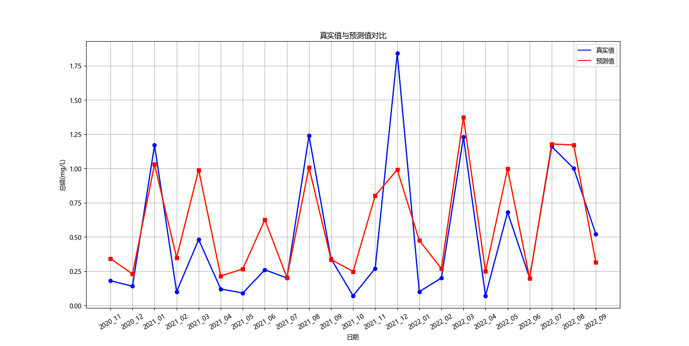   
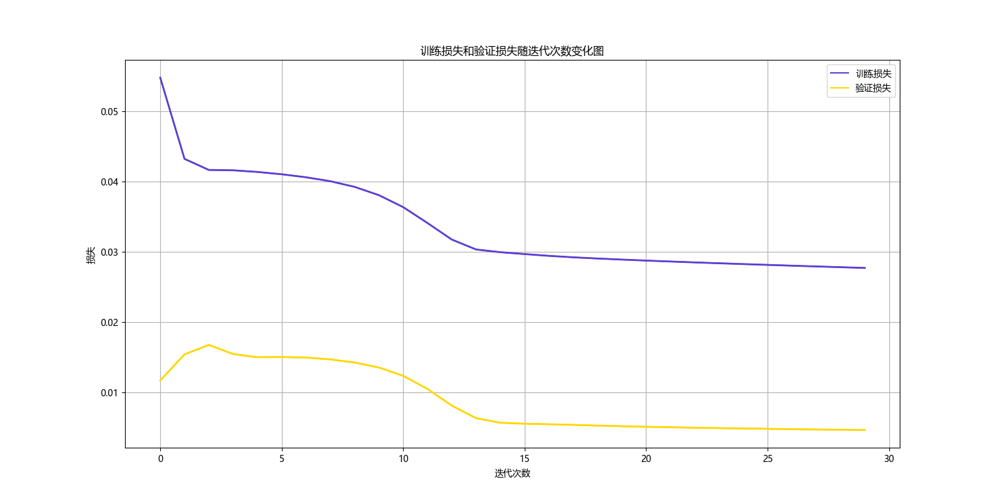  

# 小组展示
## 小组感受：

	* 韩政烨（组长）：在这周中我们学习了编程知识，学习了水文学相关知识，培养了领导能力和团队合作能力。感谢教授和学长学姐带领我们进行探究学习团队成员的互相帮助、感谢北师大和教委为我们提供了一个学习新知、展示自我的平台、感谢家长的支持。

	* 刘明浩：这次夏令营的经历让我受益匪浅。我不仅学到了编程知识和技能，还培养了团队合作精神和解决问题的能力。在未来的日子里，我会继续努力学习、关注环境。

	* 闫恩培：很高兴参加这次夏令营，我在这要一周里不仅了解了水文学的基本知识、学习了用Python构建AI模型，还培养了团队合作的精神和发散思维，让我受益匪浅。

	* 屈皓楠：这周我们参加了一次非常有意义的活动，让我们深有感悟。在这次活动中，我们不仅结识了许多新朋友，还学到了很多知识，更重要的是，通过合作编程我们意识到了团队合作的重要性，提高了表达能力，增强了社交能力，开拓了思维让我们受益匪浅。

	* 邢乂烺：随着人口增长、工业化不断推进以及社会发展很多地区的水源受到了污染，所以我打算学习Al河流检测为多个地区水源规划管理

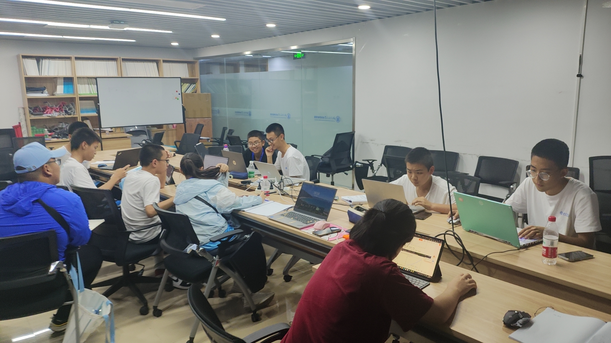  
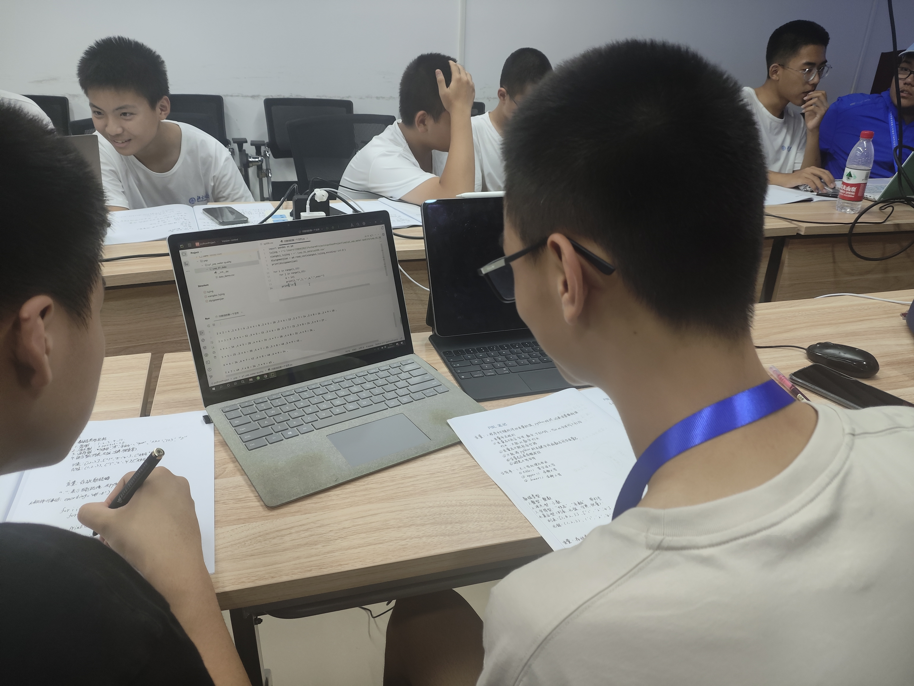  
